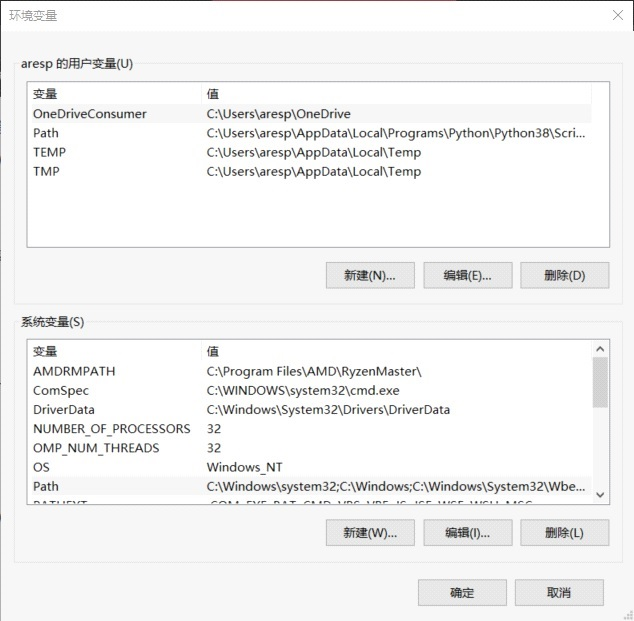
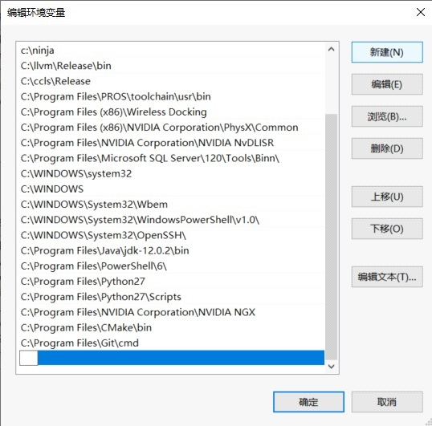

## New Century Robotics (Public Welfare) Development Environment Tutorial (WIN10-64bit 1909)
1. Install visual studio2019 and configure c ++ development environment
    - [Download](https://github.com/3038922/new_century_robotics/releases/download/v1.0/vs_community__1171082560.1567069112.exe)
    - Double-click to open the workload in the selection `使用c++的桌面开发 `and `使用c++的linux开发` installation of him

2. Install cmake
    - [Download](https://github.com/3038922/new_century_robotics/releases/download/v1.0/cmake-3.16.2-win64-x64.msi)
    - Double-click to open the installation. Note that this step chooses the second addition path as shown below.


3. Install vscode
    - [Download](https://github.com/3038922/new_century_robotics/releases/download/v1.0/VSCodeUserSetup-x64-1.41.1.exe)
    - The selection steps are as follows:


4. Install git
    - [Download](https://github.com/3038922/new_century_robotics/releases/download/v1.0/Git-2.24.1.2-64-bit.exe)
    - 选择步骤如下图:


5. Install python
    - [Download](https://github.com/3038922/new_century_robotics/releases/download/v1.0/python-3.8.1-amd64.exe)
    - Be sure to check the box `for all users`.


6. Extract ccls+llvm+ninja.zip
    - [Download](https://github.com/3038922/new_century_robotics/releases/download/v1.0/ninja+ccls+llvm.zip)
    - Download `ninja + ccls + llvm.zip` and extract it to the root directory of `c:` (let the decompression software obtain the administrator rights to extract the root directory of drive C)


7. Extract pros.zip
    - [Download](https://github.com/3038922/new_century_robotics/releases/download/v1.0/PROS.zip)
    - Download `pros.zip` and unzip to `C:\Program Files`

8. Setting environment variables
    - `右键`->`此电脑`->`属性`->`高级系统设置`->`环境变量`->`系统变量`->`新建`
    - Variable name: `PROS_TOOLCHAIN` Variable value: `C:\Program Files\PROS\toolchain\usr` 确定


    - 然后双击 `Path`



    - 点 `新建`
    - 一行一行的加
```
    c:\ninja
    c:\llvm\Release\bin
    c:\ccls\Release
    c:\Program Files\PROS\toolchain\usr\bin
```



    - 添加好了以后确定. 重启电脑.
    - 桌面空白处右键->Git Bash Here
    - 复制这句话 `pip install https://github.com/purduesigbots/pros-cli/releases/download/3.1.4/pros_cli_v5-3.1.4-py3-none-any.whl` 回车
    - 最后我们还要验证我们是否安装成功.
    - 依次输入
```
    cmake --version
    git --version
    python --version
    ninja --version
    clang --version
    ccls --version
    arm-none-eabi-gcc –version
    prosv5 --version
```


9. vscdoe plugin download and setup
    - turn on vscode
    - Choose add-ons store search `sync` selection `setting sync` and install


    - 按 `clrl + shift + p` 会弹出控制台 上面输入 `sync download setting`


    - 点下 `download public gist` 输入 `16c091a7b4ddcb213e72d430dac23422f` 回车。系统会自动下载插件。（如果没用 先选 `SYNC 重置扩展设置` 再 `download public gist`）

