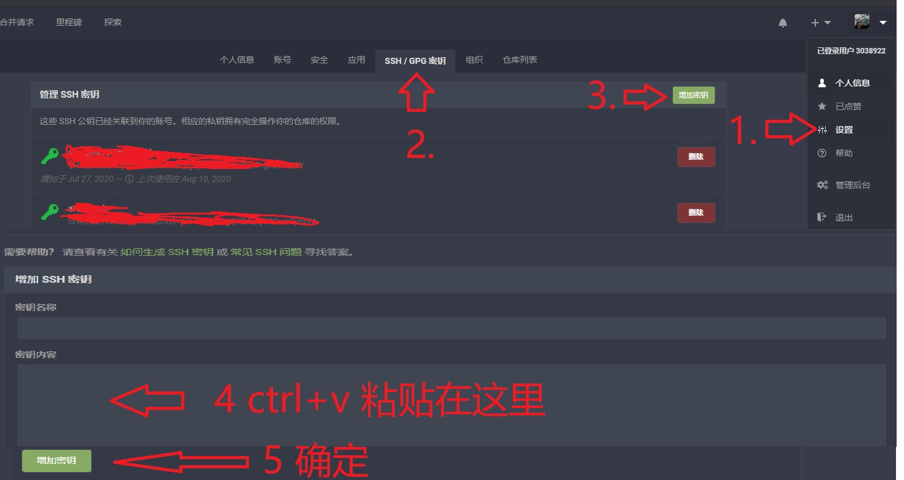

## 关于免密登录

- 可以先打开 `C:\Users\你的用户名\.ssh\` 看看有没这个文件夹
- 如果没有重新创建密匙,如果有则进入[上传密匙](####上传密匙)

### 创建密匙

- 先输入 `ssh-keygen -t rsa`
- 之后一路回车 类似下面这样

```sh
  fdipzone@ubuntu:~\$ ssh-keygen -t rsa
  Generating public/private rsa key pair.
  Enter file in which to save the key (/home/fdipzone/.ssh/id_rsa):
  Enter passphrase (empty for no passphrase):
  Enter same passphrase again:
  Your identification has been saved in /home/fdipzone/.ssh/id_rsa.
  Your public key has been saved in /home/fdipzone/.ssh/id_rsa.pub.
  The key fingerprint is:
  f2:76:c3:6b:26:10:14:fc:43:e0:0c:4d:51:c9:a2:b0 fdipzone@ubuntu
  The key's randomart image is:
  +--[ RSA 2048]----+
  | .+=\*.. |
  | . += + |
  | o oo+ |
  | E . . o |
  | ..S. |
  | .o . |
  | .o + |
  | ...oo |
  | +. |
  +-----------------+
```

- 生成的密匙文件在 
  - linux 
  直接使用命令 `cat /home/你的用户名/.ssh/id_rsa.pub` 
```
cd ~
cat .ssh/id_rsa.pub
```
  查看 并且复制粘贴到`代码仓库`里
    

  - windows 
  - 可以先打开 `C:\Users\你的用户名\.ssh\`
  - 然后用`vscode`打开`id_rsa.pub`
  - `ctrl+A`全选 `ctrl+c` 复制
    

- 随便找个项目用`SSH`下载试试
