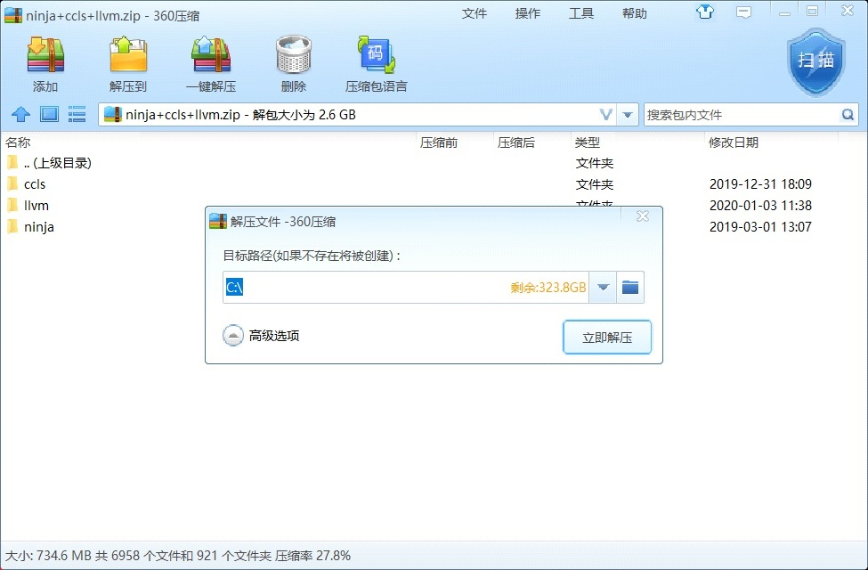
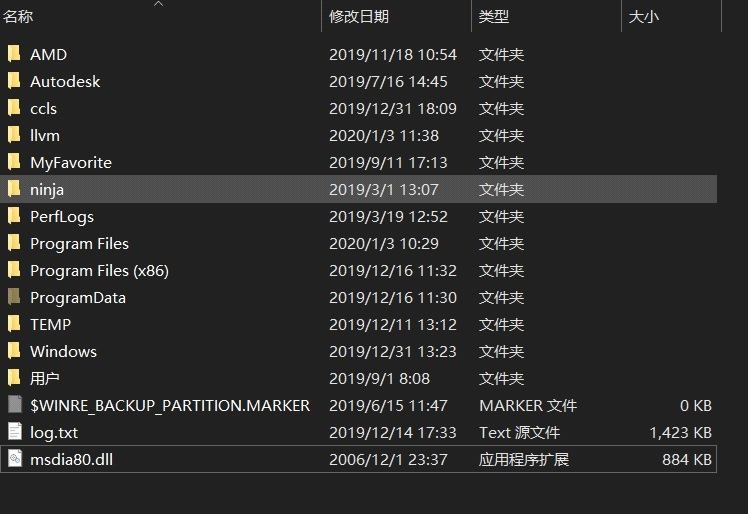
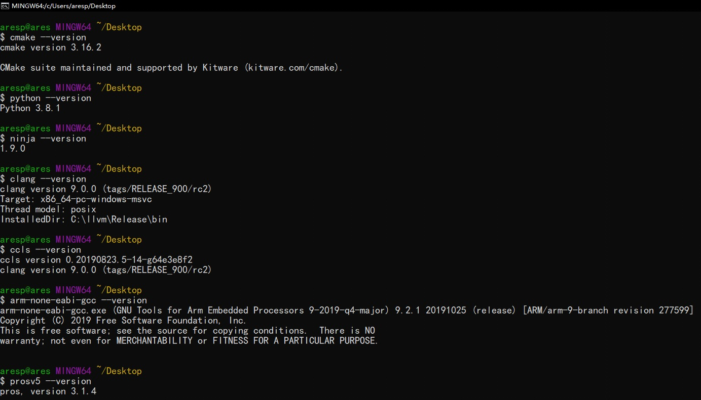
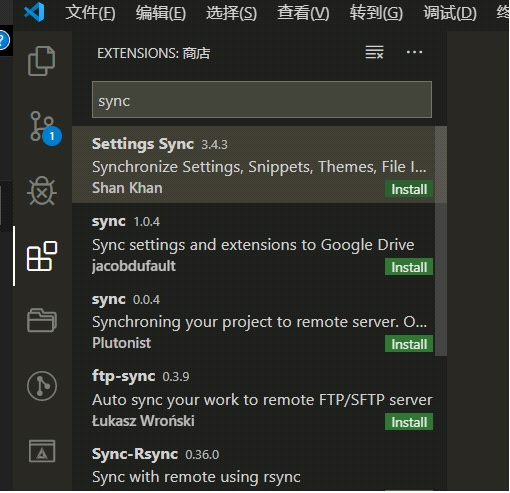

## New Century Robotics (Public Welfare) Development Environment Tutorial (WIN10-64bit 1909)

[中文](./readme_cn.md)

1. Install visual studio2019 and configure c ++ development environment

   - [Download](https://github.com/3038922/new_century_robotics/releases/download/v1.0/vs_community__1171082560.1567069112.exe)
   - Double-click to open the workload in the selection `Desktop development using C++`and `Linux development using C++` installation of him

2. Install cmake
   - [Download](https://github.com/3038922/new_century_robotics/releases/download/v1.0/cmake-3.16.2-win64-x64.msi)
   - Double-click to open the installation. Note that this step chooses the second addition path as shown below.


3. Install vscode
   - [Download](https://github.com/3038922/new_century_robotics/releases/download/v1.0/VSCodeUserSetup-x64-1.41.1.exe)
   - The selection steps are as follows:


4. Install git
   - [Download](https://github.com/3038922/new_century_robotics/releases/download/v1.0/Git-2.24.1.2-64-bit.exe)
   - The selection steps are as follows:


5. Install python
   - [Download](https://github.com/3038922/new_century_robotics/releases/download/v1.0/python-3.8.1-amd64.exe)
   - Be sure to check the box `for all users`.


6. Extract `ccls+llvm+ninja.zip`
   - [Download](https://github.com/3038922/new_century_robotics/releases/download/v1.0/ninja+ccls+llvm.zip)
   - Download `ninja + ccls + llvm.zip` and extract it to the root directory of `c:` (let the decompression software obtain the administrator rights to extract the root directory of drive C)




7. Extract `pros.zip`

   - [Download](https://github.com/3038922/new_century_robotics/releases/download/v1.0/PROS.zip)
   - Download `pros.zip` and unzip to `C:\Program Files`

8. Setting environment variables

- [Download](https://github.com/3038922/new_century_robotics/blob/master/add_environment_var.ps1)
-
- OK after adding. Restart the computer.
- Right click on the blank space on the desktop-> Git Bash Here
- Copy this sentence `pip install https://github.com/purduesigbots/pros-cli/releases/download/3.1.4/pros_cli_v5-3.1.4-py3-none-any.whl`
- Finally, we need to verify that our installation was successful.
- Enter one by one

```
    cmake --version
    git --version
    python --version
    ninja --version
    clang --version
    ccls --version
    arm-none-eabi-gcc --version
    prosv5 --version
```



9. vscdoe plugin download and setup
   - turn on vscode
   - Choose add-ons store search `sync` selection `setting sync` and install



- Press `clrl + shift + p` will pop up above the console input `sync download setting`


- Under point `download public gist` input `6c091a7b4ddcb213e72d430dac23422f`Enter. The plugin will be downloaded automatically. (If useless before the election `SYNC Reset extended settings` and then `download public gist`）


## 关于中文报错问题

- `pros-cli3 3.1.4` 有一个中文支持的 BUG 错误返回如下:

```sh
Exception in thread Thread-1:
Traceback (most recent call last):
  File "c:\users\aresp\appdata\local\programs\python\python37\lib\threading.py", line 917, in _bootstrap_inner
    self.run()
  File "c:\users\aresp\appdata\local\programs\python\python37\lib\site-packages\pros\common\ui\__init__.py", line 180, in run
    for line in iter(self.pipeReader.readline, ''):
UnicodeDecodeError: 'gbk' codec can't decode byte 0x80 in position 10: illegal multibyte sequence
```

- 打开`c:\users\你的用户名\appdata\local\programs\python\python37\lib\site-packages\pros\common\ui\__init__.py`
- 修改 `kwargs['file'] = open(os.devnull, 'w')` 为 `kwargs['file'] = open(os.devnull, 'w', encoding='UTF-8')`
- 修改 `self.pipeReader = os.fdopen(self.fdRead)` 为 `self.pipeReader = os.fdopen(self.fdRead, encoding='UTF-8')`

## linux ubuntu-1803

1. Install common software:`sudo apt install cmake python3 ninja-build gcc-8 llvm-9 clang-9`
2. Install SDL2 `sudo apt-get update && sudo apt-get install -y build-essential libsdl2-dev`
3. Install `vscode`
4. Install `prosv5`
