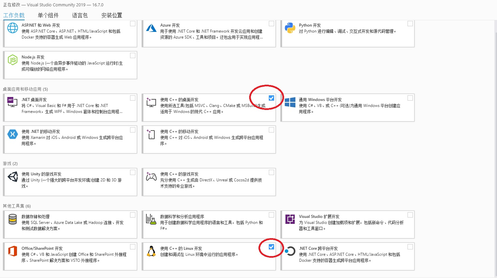
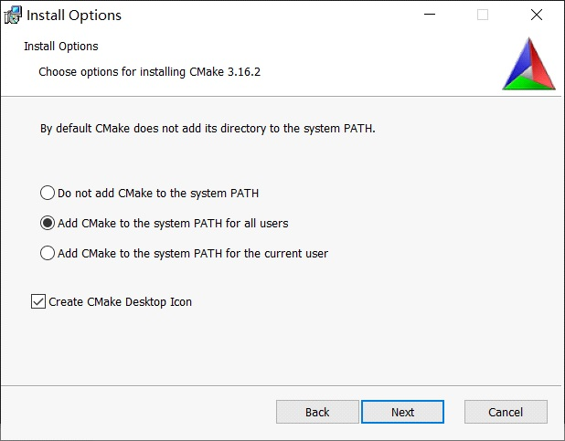
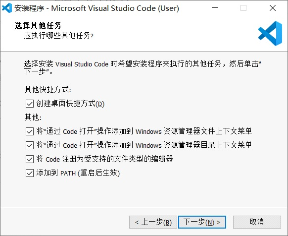
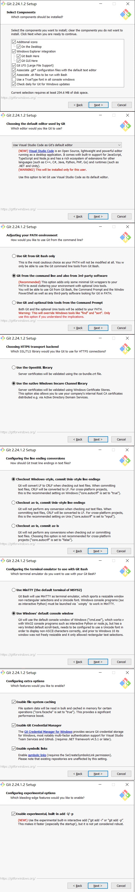
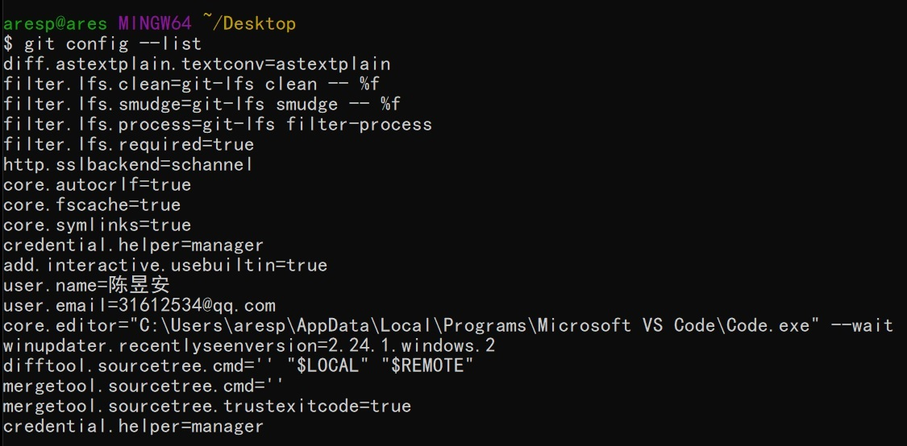
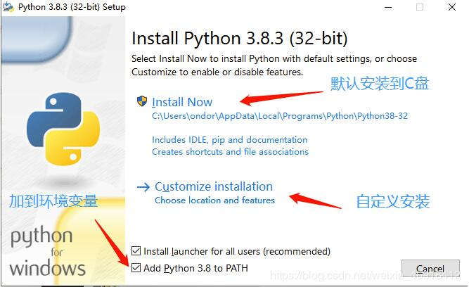
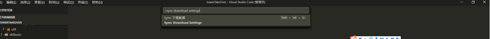
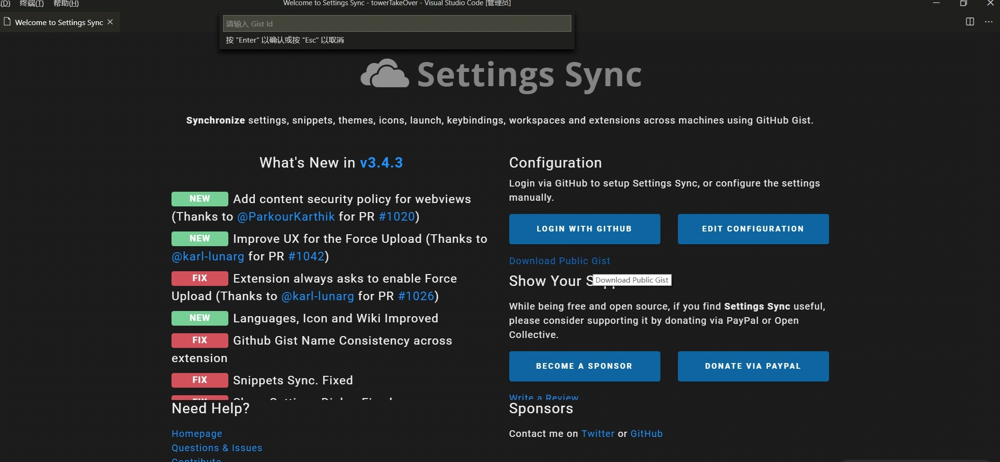

## New Century Robotics (Public Welfare) Development Environment Tutorial (WIN10-64bit 1909)

- [中文文档](./readme_cn.md)

1. Install visual studio2019 and configure c ++ development environment

- [Download](https://github.com/3038922/new_century_robotics/releases/download/v1.0/vs_community__1548256886.1596784179.exe)
- Double-click to open the workload in the selection `Desktop development using C++`and `Linux development using C++` installation of him

2. Install cmake

- [Download](https://github.com/3038922/new_century_robotics/releases/download/v1.0/cmake-3.18.1-win64-x64.msi)
- Double-click to open the installation. Note that this step chooses the second addition path as shown below.

3. Install vscode

- [Download](https://github.com/3038922/new_century_robotics/releases/download/v1.0/VSCodeUserSetup-x64-1.47.3.exe)
- The selection steps are as follows:

4. Install git

- [Download](https://github.com/3038922/new_century_robotics/releases/download/v1.0/Git-2.27.0-64-bit.exe)
- The selection steps are as follows:

- git global configuration user name `git config --global user.name "nameVal"`
- git global configuration email `git config --global user.email "eamil@qq.com"`

5. Install python

- [Download](https://github.com/3038922/new_century_robotics/releases/download/v1.0/python-3.8.5-amd64.exe)
- Be sure to check the box `for all users`.

6. Automated installation and configuration of environment variables using scripts

- [Download](https://github.com/3038922/new_century_robotics/releases/download/v1.0/build_en.ps1)
- I save this script on my desktop,Click the file in the upper left corner.Click to `open windows PowerShell as administrator`
- input `.\build_en.ps1`
  If unable to execute, please enter `Set-ExecutionPolicy Unrestricted` Set execution policy to Unrestricted

- OK after adding. Restart the computer.

7. vscdoe plugin download and setup

- turn on vscode

- Press `clrl + shift + p` will pop up above the console input `sync download setting`

- Under point `download public gist` input `6c091a7b4ddcb213e72d430dac23422f`Enter. The plugin will be downloaded automatically. (If useless before the election `SYNC Reset extended settings` and then `download public gist`）

## linux support

- [linux 开发环境教程](./linux_support.md)
