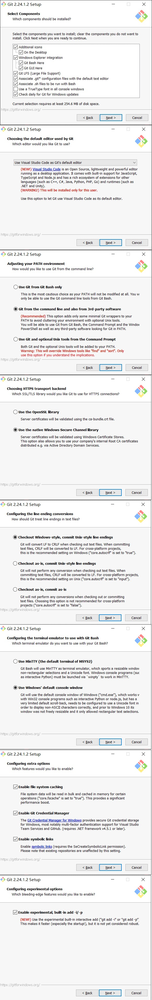

## 新世纪机器人（公益）开发环境教程（WIN10-64bit 1909）

[English](./readme.md)

1. 安装 Visual Studio2019 并配置 C ++开发环境

   - [另存为](./soft/vs_community__1548256886.1596784179.exe)
   - Double-click to open the workload in the selection `Desktop development using C++`and `Linux development using C++` installation of him

2. 安装 cmake

   - [另存为](./soft/cmake-3.16.2-win64-x64.msi)
   - Double-click to open the installation. Note that this step chooses the second addition path as shown below.
     

3. 安装 vscode
   - [另存为](./soft/VSCodeUserSetup-x64-1.47.3.exe)
   - The selection steps are as follows:


4. 安装 git

   - [另存为](./soft/Git-2.27.0-64-bit.exe)
   - The selection steps are as follows:
     
     

5. 安装 python

   - [另存为](./soft/python-3.8.5-amd64.exe)
   - Be sure to check the box `for all users`.
     

6. 解压缩 `ccls + llvm + ninja.zip`

   - [另存为](https://qzrobot.top/index.php/s/bTdZJ6SefSGbLzd)
   - Download `ninja + ccls + llvm.zip` and extract it to the root directory of `c:\` (let the decompression software obtain the administrator rights to extract the root directory of drive C)
     
     

7. 解压缩 `pros.zip`

   - [另存为](https://qzrobot.top/index.php/s/PSbyBdMJ2Ti8ZT8)
   - Download `pros.zip` and unzip to `C:\Program Files`

8. 设置环境变量

   - [另存为](./script/add_environment_var.ps1)
   - 我将此脚本另存在桌面,点击左上角文件,点击`以管理员身份打开 windows powershell`
     
   - 输入 `.\add_environment_var.ps1`
   - 执行完毕后,重新启动计算机。
   - 右键单击桌面上的空白-> Git Bash 此处
   - 复制这句话 `pip install https://github.com/purduesigbots/pros-cli/releases/download/3.1.4/pros_cli_v5-3.1.4-py3-none-any.whl`
   - 最后，我们需要验证安装是否成功。.
   - 一句句输入:

   ```
      cmake --version
      git --version
      python --version
      ninja --version
      clang --version
      ccls --version
      arm-none-eabi-gcc --version
      prosv5 --version
   ```

   

9. vscdoe 插件下载和设置

   - turn on vscode
   - Choose add-ons store search `sync` selection `setting sync` and install
     
   - Press `clrl + shift + p` will pop up above the console input `sync download setting`
     
   - Under point `download public gist` input `6c091a7b4ddcb213e72d430dac23422f`Enter. The plugin will be downloaded automatically. (If useless before the election `SYNC Reset extended settings` and then `download public gist`）
     

## 关于中文报错问题

- `pros-cli3 3.1.4` 有一个中文支持的 BUG 错误返回如下:

```sh
Exception in thread Thread-1:
Traceback (most recent call last):
File "c:\users\aresp\appdata\local\programs\python\python37\lib\threading.py", line 917, in _bootstrap_inner
   self.run()
File "c:\users\aresp\appdata\local\programs\python\python37\lib\site-packages\pros\common\ui\__init__.py", line 180, in run
   for line in iter(self.pipeReader.readline, ''):
UnicodeDecodeError: 'gbk' codec can't decode byte 0x80 in position 10: illegal multibyte sequence
```

- 打开`c:\users\你的用户名\appdata\local\programs\python\python37\lib\site-packages\pros\common\ui\__init__.py`
- 修改 `kwargs['file'] = open(os.devnull, 'w')` 为 `kwargs['file'] = open(os.devnull, 'w', encoding='UTF-8')`
- 修改 `self.pipeReader = os.fdopen(self.fdRead)` 为 `self.pipeReader = os.fdopen(self.fdRead, encoding='UTF-8')`

## linux ubuntu-1803

1. Install common software:`sudo apt install cmake python3 ninja-build gcc-8 llvm-9 clang-9`
2. Install SDL2 `sudo apt-get update && sudo apt-get install -y build-essential libsdl2-dev`
3. Install `vscode`
4. Install `prosv5`
