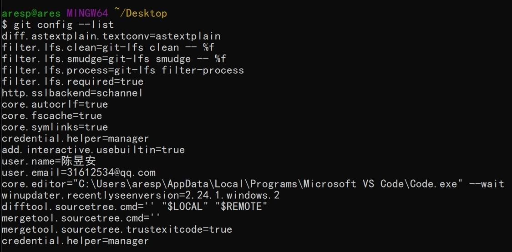
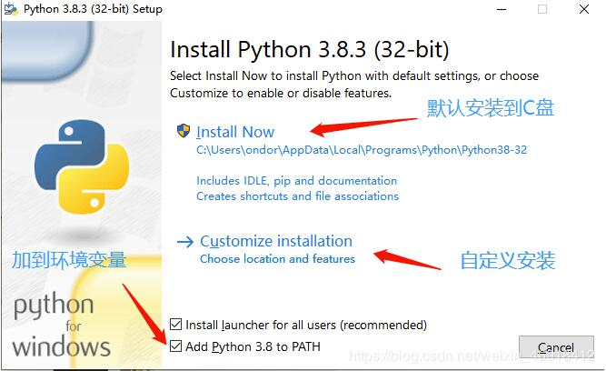

## 新世纪机器人（公益）开发环境教程（WIN10-64bit 1909）

- [English Document](./readme.md)

1. 安装 Visual Studio2019 并配置 C ++开发环境

- [下载](https://qzrobot.top/index.php/s/ckFtR2YwynSrSiz/download)
- 安装的时候选择`使用C++的桌面开发`和 `使用c++的Linux开发`

2. 安装 cmake

- [下载](https://qzrobot.top/index.php/s/9PpsXD9yxAd85sd/download)
- 双击打开安装。请注意，此步骤选择第二条添加路径，如下所示。

3. 安装 vscode

- [下载](https://qzrobot.top/index.php/s/ySZieKANW5GedZM/download)
- 选择步骤如下：

4. 安装 git

- [下载](https://qzrobot.top/index.php/s/afkWMfGGrZxZcaR/download)
- 选择步骤如下：

- git 全局配置用户名 `git config --global user.name "nameVal"`
- git 全局配置邮箱 `git config --global user.email "eamil@qq.com"`

5. 安装 python

- [下载](https://qzrobot.top/index.php/s/THniMLtpTa4j3j5/download)
- 确保选中 `for all users`.

6. 使用脚本自动化安装和配置环境变量

- [下载](https://qzrobot.top/index.php/s/wzNnD2JW59ocTpH/download)

- 我将此脚本另存在桌面,点击左上角文件,点击`以管理员身份打开 windows powershell`
- 再输入 `./build_cn.ps1`
  如果无法执行 请输入 `Set-ExecutionPolicy Unrestricted` 将执行策略设置为 Unrestricted

- 执行完毕后,重新启动计算机。

7. vscdoe 插件下载和设置

- 打开 vscode

- 按下 `clrl + shift + p` 输入 `sync download setting`

- 点击 `download public gist` 输入 `6c091a7b4ddcb213e72d430dac23422f` 回车.

- 如果没有弹出上面的页面,输入 `SYNC Reset extended settings` 然后点击 `download public gist`

## 关于免密登录

- [GIT 免密登录](./git_id_ras_support.md)

## 编程相关

- [编程相关](./about_program.md)

## GIT 命令

- [GIT 命令](./about_git.md)

## linux support

- [linux install](./linux_support.md)
