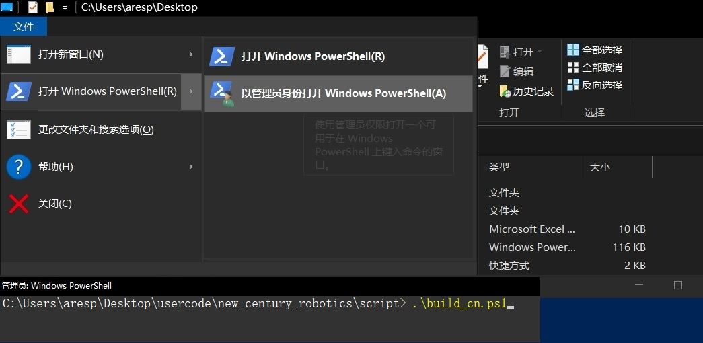

# 开发环境安装及配置

1. 使用脚本自动化安装和配置环境变量
- [下载](https://qzrobot.top/index.php/s/mCYYdKwRjpb5JrY/download/build_cn.ps1)
- 我将此脚本另存在桌面,点击左上角文件,点击`以管理员身份打开 windows powershell`

- 输入 `Set-ExecutionPolicy Unrestricted` 将执行策略设置为 Unrestricted
- 再输入 `./build_cn.ps1`
- 如果无法执行 
  如果还不行 试试输入`Set-ExecutionPolicy RemoteSigned -Scope CurrentUser`   再重复之前的操作
- 百度这两个命令会导致系统出错 不要使用
  `Set-ExecutionPolicy -ExecutionPolicy Undefined -Scope LocalMachine` 本地计算机的所有用户删除执行策略
  `Set-ExecutionPolicy -ExecutionPolicy Undefined -Scope CurrentUser`删除 作用域 的执行策略 

2. vscode 插件下载和设置
- 打开 vscode
- 按下 `ctrl + shift + p` 
- 输入 `sync advanced options`

- 然后选择 `sync 打开设置`

- 在Gist ID 里 输入 `6c091a7b4ddcb213e72d430dac23422f` 回车.

- 最后按 `cttl + alt + d`下载插件

3. 字体安装
- [下载](https://qzrobot.top/index.php/s/5dzkSdCxLGRo3Sa/download/font.rar)
- 解压缩后,全选批量安装
- 执行完毕后,重新启动计算机。

## 开发环境装好后要设置代码仓库的免密登录,不然不能下载代码
- [GIT 免密登录](../git/git_id_ras_support.md)

## 如果遇到问题,可以手动安装下列软件.一般不需要手动开发环境安装及配置
- [开发环境安装及配置](./vex/Manual_Installation.md)

## linux 下安装开发环境
- [linux install](./Dev_Environment_linux.md)
