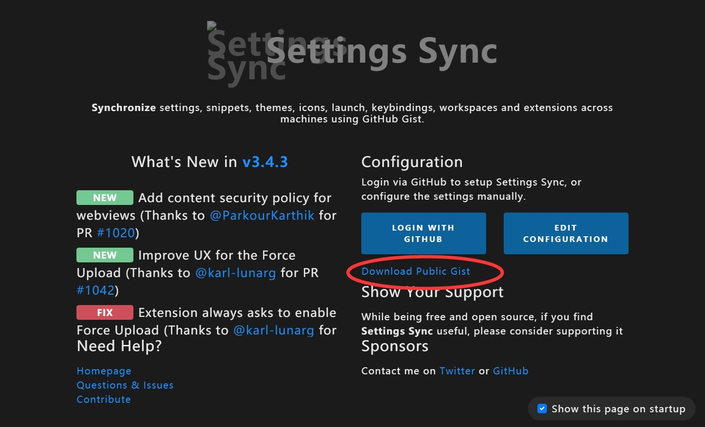

## linux ubuntu-20.04
1. 修改DNS `sudo nano /etc/systemd/resolved.conf`
   - 很容易找到DNS位置，默认已被注释，去掉#号，添加自己的dns地址  `DNS=10.255.0.253 202.96.113.34` 
   - 保存并退出 `:wq` 
   - `sudo rm -rf /etc/resolv.conf`
   - `sudo ln -s /run/systemd/resolve/resolv.conf /etc/resolv.conf`
   - 最后 `sudo systemctl restart systemd-resolved && sudo systemctl enable systemd-resolved`

2. 换源 `sudo nano /etc/apt/sources.list` 更换成下面的
```
deb http://mirrors.aliyun.com/ubuntu/ focal main restricted universe multiverse
deb http://mirrors.aliyun.com/ubuntu/ focal-security main restricted universe multiverse
deb http://mirrors.aliyun.com/ubuntu/ focal-updates main restricted universe multiverse
deb http://mirrors.aliyun.com/ubuntu/ focal-backports main restricted universe multiverse

# deb-src http://mirrors.aliyun.com/ubuntu/ focal main restricted universe multiverse
# deb-src http://mirrors.aliyun.com/ubuntu/ focal-security main restricted universe multiverse
# deb-src http://mirrors.aliyun.com/ubuntu/ focal-updates main restricted universe multiverse
# deb-src http://mirrors.aliyun.com/ubuntu/ focal-backports main restricted universe multiverse
```
- 换好 `ctrl+x`然后`回车`确认更改后退出
- 更新系统
- 先使用本地服务器更新
``` 
sudo http_proxy=http://10.255.0.194:3142 apt-get -o pkgProblemResolver=true -o Acquire::http=true update && \
sudo http_proxy=http://10.255.0.194:3142 apt-get -o pkgProblemResolver=true -o Acquire::http=true upgrade --fix-missing -y
```   
- 再使用外部服务器更新
```
sudo apt update && sudo apt upgrade -y
```


3. 安装常用软件和开发软件:
```
wget -q -O - https://dl-ssl.google.com/linux/linux_signing_key.pub | sudo apt-key add -
sudo add-apt-repository "deb http://dl.google.com/linux/chrome/deb/ stable main"

wget -q https://packages.microsoft.com/keys/microsoft.asc -O- | sudo apt-key add -
sudo add-apt-repository "deb [arch=amd64] https://packages.microsoft.com/repos/vscode stable main"

sudo http_proxy=http://10.255.0.194:3142 apt-get -o pkgProblemResolver=true -o Acquire::http=true update && \
sudo http_proxy=http://10.255.0.194:3142 apt-get -o pkgProblemResolver=true -o Acquire::http=true install vim git curl cmake  clangd-12 python3-pip ninja-build gcc llvm clang rar zsh vim  software-properties-common apt-transport-https wget openvpn  gcc-arm-none-eabi google-chrome-stable code -y
```

- (如果自动装失败) 下载 chrome `wget https://qzrobot.top/index.php/s/k6oYH3gN7pkQ89e/download/google-chrome-stable_current_amd64.deb && sudo apt install ./google-chrome-stable_current_amd64.deb`

- (如果自动装失败) 安装vscode 
   `wget https://qzrobot.top/index.php/s/e39TKeQKcWRBBqG/download/code.deb && sudo apt install ./code.deb`

6. 给vscode装插件
   - 先装同步插件 `code --install-extension shan.code-settings-sync`
   - 然后按图点 `Download Public Gist` 输入`6c091a7b4ddcb213e72d430dac23422f` 回车.
   - 
7. 设置git名字和email
   - 输入你的名字: `git config --global user.name "xxx"` 比如 `"dog" "cat"`
   - 输入你的Email:`git config --global user.email "xxxx@qq.com"` 比如 `"1234@qq.com"`
8. 安装vex相关开软件
   - `sudo pip install --upgrade pros-cli -i https://pypi.tuna.tsinghua.edu.cn/simple`

9. 然后去完成免密登陆 
   - [GIT 免密登录](../git/git_id_ras_support.md)


## 其他
  - 装个 `oh-my-zsh` 美化下,可选 
  -  修改默认终端为zsh `chsh -s /bin/zsh` 然后输入 `zsh`进入zsh 
  - 安装oh my zsh(国内源) `sh -c "$(curl -fsSL https://gitee.com/pocmon/ohmyzsh/raw/master/tools/install.sh)"`
  - `vim .zshrc`修改主题,我用 `ZSH_THEME="agnoster"` 有很多插件和主题可以装,自己百度
  - 使其生效 `source .zshrc`

  - 这个属于个性化修改,不需要都一样,自己百度.vim也可以装很多插件变成IDE
  - TIM 微信等安装`sudo wget -O- https://deepin-wine.i-m.dev/setup.sh | sh`  
<!-- 2. Install SDL2 `sudo apt-get update && sudo apt-get install -y build-essential libsdl2-dev`
3. Install `vscode`
4. Install `prosv5` -->
