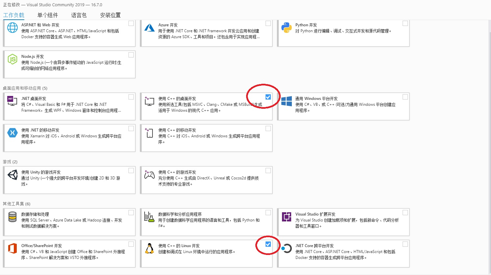
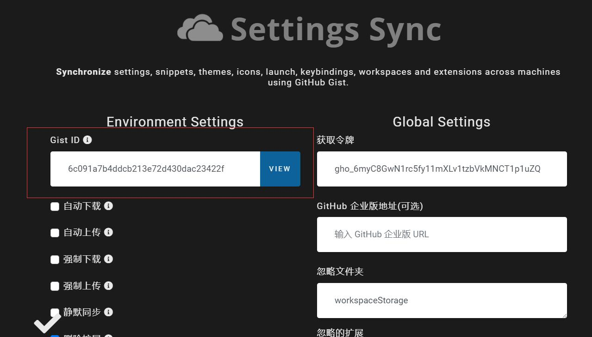

# 手动安装常规软件
1. 安装visual studio 2019
- [Download](https://qzrobot.top/index.php/s/TRZwkD9dJNxZoWk/download)
- 选择 `使用C++的桌面开发`and `使用C++的LINUX开发`,然后安装.

2. 安装 vscode
- [下载](https://qzrobot.top/index.php/s/KBZt4TjzGGBbkeH/download)
- 选择步骤如下：

3. 安装 git
- [下载](https://qzrobot.top/index.php/s/aHPm5H9622DyLRg/download)
- 选择步骤如下：

- git 全局配置用户名 `git config --global user.name "nameVal"`
- git 全局配置邮箱 `git config --global user.email "eamil@qq.com"`

4. 安装 python
- [下载](https://qzrobot.top/index.php/s/iGrYQCqotTWZn6e/download)
- 确保选中 `Add Python 3.x to Path`.
- 然后选 `Install Now` 默认安装到 C 盘即可

5. 安装LLVM
- [下载](https://qzrobot.top/index.php/s/T8KFKR6xHeDy9kj/download)
- 解压缩到`C:\ncrRobotics`
- 添加环境变量`c:\ncrRobotics\llvm\Release\bin`

6. 安装NINJA
- [下载](https://qzrobot.top/index.php/s/Nd2P2Rnx9c6Gnmo/download)
- 解压缩到`C:\ncrRobotics`
- 添加环境变量`c:\ncrRobotics\ninja`

7. 安装CCLS
- [下载](https://qzrobot.top/index.php/s/KYAc4zpC6r3xZ7z/download)
- 解压缩到`C:\ncrRobotics`
- 添加环境变量`c:\ncrRobotics\ccls\Release`

8. 安装cmake
- [下载](https://qzrobot.top/index.php/s/KYAc4zpC6r3xZ7z/download)
- 解压缩到`C:\ncrRobotics`
- 添加环境变量`c:\ncrRobotics\ccls\Release`

9. 安装PROS
- [下载](https://qzrobot.top/index.php/s/DsYXwWWa2asN5Ar/download)
- 解压缩到 `C:\ncrRobotics`
- 添加环境变量 `c:\ncrRobotics\PROS\toolchain\usr\bin` 
- 新建系统变量 变量名: `PROS_TOOLCHAIN` 变量值: `c:\ncrRobotics\PROS\toolchain\usr`

10. vscode 插件下载和设置

- 打开 vscode
- 按下 `ctrl + shift + p` 
- 输入 `sync advanced options`

- 然后选择 `sync 打开设置`

- 在Gist ID 里 输入 `6c091a7b4ddcb213e72d430dac23422f` 回车.

- 最后按 `cttl + alt + d`下载插件

11. 字体安装

- [下载](https://qzrobot.top/index.php/s/5dzkSdCxLGRo3Sa/download/font.rar)
- 解压缩后,全选批量安装

### 开发环境装好后要设置代码仓库的免密登录,不然不能下载代码
- [GIT 免密登录](../git/git_id_ras_support.md)

- 执行完毕后,重新启动计算机。