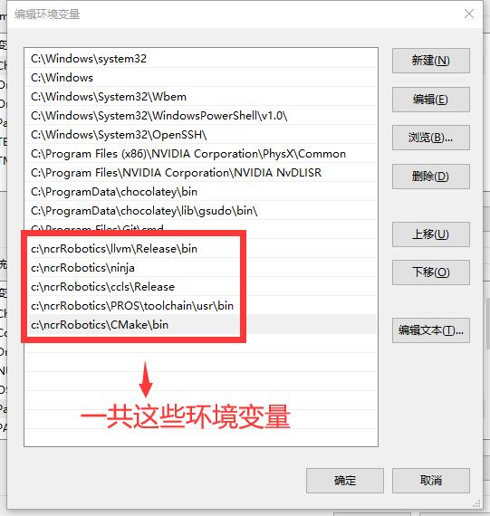
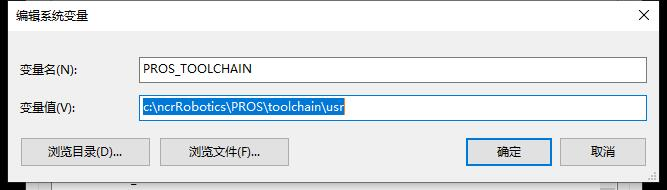

# 常见错误
1. 点更新处乱乱码或者提示HOST不一致

- 这是因为陈老师改了服务地址导致的HOST验证不一致.
- 删除 `c:/用户/你的用户名/.ssh/known_hosts` 
- 然后 删除此项目 重新下载下就好了.有东西没上传的同学自认倒霉.

2. 打开范例程序瞎报错问题 
- 控制台执行 `make clean` `pros build-compile-commands`

3. 控制台字体丑陋 
- 下载个字体装下 [字体下载](https://qzrobot.top/index.php/s/afkWMfGGrZxZcaR/download)

4. 各种奇怪的错误导致无法编译
  1. 检查环境变量 和 系统环境变量
  
  